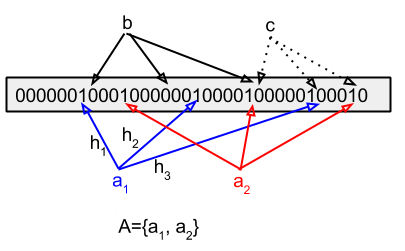
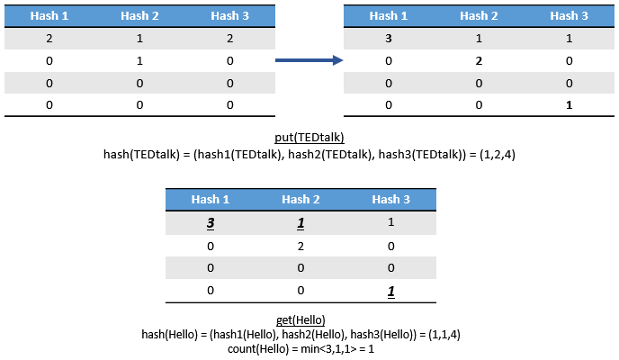

# CẤU TRÚC DỮ LIỆU

- [CẤU TRÚC DỮ LIỆU](#c%E1%BA%A5u-tr%C3%BAc-d%E1%BB%AF-li%E1%BB%87u)
  - [Tính chất của Probabilistic data structure](#t%C3%ADnh-ch%E1%BA%A5t-c%E1%BB%A7a-probabilistic-data-structure)
  - [Bloom Filters](#bloom-filters)
    - [Cách hoạt động Bloom Filters](#c%C3%A1ch-ho%E1%BA%A1t-%C4%91%E1%BB%99ng-bloom-filters)
    - [Hash function trong Bloom Filter](#hash-function-trong-bloom-filter)
    - [Đánh giá Bloom Filter](#%C4%91%C3%A1nh-gi%C3%A1-bloom-filter)
  - [Cuckoo Filters](#cuckoo-filters)
  - [Count Min Sketch](#count-min-sketch)
  - [HyperLogLog](#hyperloglog)
  - [Trie](#trie)
    - [Tổng quát về Trie](#t%E1%BB%95ng-qu%C3%A1t-v%E1%BB%81-trie)
    - [Đánh giá Trie](#%C4%91%C3%A1nh-gi%C3%A1-trie)
    - [Ứng dụng của Trie](#%E1%BB%A9ng-d%E1%BB%A5ng-c%E1%BB%A7a-trie)
  - [Tham khảo](#tham-kh%E1%BA%A3o)

## Tính chất của Probabilistic data structure

Cấu trúc dữ liệu xác xuất là một nhóm cấu trúc dữ liệu cực kỳ hữu ích cho các ứng dụng truyền dữ liệu và big data.Các cấu trúc dữ liệu này sử dụng các hàm hash để ngẫu nhiên hóa và biểu diễn gọn gàng một tập hợp các item. Collision bị bỏ quia nhưng lỗi có thể được soát tốt dưới ngưỡng nhất định. so sánh với các phương phát error-free, các thuật toán này sử dụng ít bộ nhớ hơn và có thời gian truy vấn không đổi. Chúng thường hỗ trợ các phép union, intersection.

## Bloom Filters

### Cách hoạt động Bloom Filters

`Bloom filter` là một cấu trúc dữ liệu xác xuất để kiểm tra xem 1 phần tử có thuộc 1 tập dữ liệu hay không một cách nhanh chóng và tiết kiệm bộ nhớ.

Bản chất của bloom filter là một vector các bit. Một bloom filter rỗng là một vector các bit có giá trị là 0. Nó cần k hàm hash để map một cách ngẫu nhiên và đồng đều các phần tử vào mảng bit. Sống lượng hàm hash và độ dài của vector bit sẽ ảnh hưởng đến độ chính xác của kết quả.

Bloom filter có 2 tác vụ cơ bản: **Thêm** và **Kiểm tra**

- **Thêm:** khi thêm một phần tử mới trong S vào, dùng k hàm Hash với đầu vào là phần tử mới đó ta sẽ được k vị trí các bit được bật lên trong chuỗi m bit.
- **Kiểm tra:** Khi kiểm tra một phần tử thì cũng sử dụng k hàm Hash với đầu vào là phần tử có tính ra k vị trí trong mảng. Sau đó kiểm tra xem tất cả các bit đó có giá trị 1 hay không. Chỉ chần phát hiện một vị trí có giá trị là 0 phầ n tử đó chắc chắn không nằm trong danh sách. Còn tất cả các vị trí đều ra giá trị 1 thì **có thể** phần tử đó nằm trong danh sách

    

### Hash function trong Bloom Filter

**Hash function** sử dụng trong bloom filter nên là những hàm hash có tính độ lập và kết quả là một tập hợp được phân bố một cách đồng đều. Giải pháp cho vấn đề này là **Double Hashing**

***hashi(x,m) = (hasha(x) + i × hashb(x)) mod m***

### Đánh giá Bloom Filter

Việc **kiểm tra**, ta có thể thấy rằng có thể có false positive (không thuộc tập dữ liệu, nhưng hàm hash cho ra k vị trí bit là 1), nhưng không thể có false negative (Do tác vụ thêm một phần tử thì phần tử đó phải có k vị trí là 1, nhưng chỉ cần có một vị trí là 0 là kết luận là negative).

Việc false positive sẽ càng tăng nếu kích thước *m* (độ dài bitarray) càng nhỏ và độ lớn của tập dữ liệu càng tăng.

## Cuckoo Filters

`Cuckoo Filters` hoạt động bằng cách hasing một mục nhập với một hàm hash và  chền f-bit fingerprint cảu mục nhập vào một vị trí mở trong một trong hai bucket thay thế. Khi cả hai buckets đầy, filter đệ  quy các mục hiện có vào các thùng thay thế của chúng cho đến khi space được tìm thấy hoặc các nỗ lực đã hết. Tra cứu lặp lại hash function và kiểm tra cả hai bucket cho fingerprint. Khi không tìm thấy fingerprint phù hợp, mục nhập chắc chắn không có trong bộ lọc. Khi tìm thấy fingerprint phù hợp trong một trong hai bucket, mục nhập có thể nằm trong bộ lọc.

Fingerprint là một chuỗi bit có kích thước cố định sinh ra từ mỗi phần tử đầu vào bằng cách băm chính phần tử nhập vào.

Bộ lọc Cuckoo sử dụng các tính chât sau của phép `xor (⊕)` để giải quyết việc tifkm kiếm ngược lại vị trí thay thế cho phần tử bị đẩy ra khi xảy ra đụng độ

- (A ⊕ B) ⊕ C = A ⊕ (B ⊕ C) (1)
- A ⊕ A = 0 (2)
- A ⊕ 0  = A (3)

Với mỗi phần tử x đầu vào bảng băm của Cuckoo filter, vị trí hai bucket tiềm năng được xác đinh bằng kỹ thuật partial-ky cuckoo hashing:

- h1(x) = hash(x) (4)
- h2(x) = h1 ⊕ hash(f) với f = fingerprint(x) (5)

Sử dụng các tính chất của `xor (⊕)`, ta nhận thấy h1 có thể được tính ngược từ h2 và fingerprint f với cùng công thức (5)

- h1(x) = h2(x) ⊕ hash(f)

Vì h1(x) và h2(x) có thể suy ra được lẫn nhau bằng việc sử dụng chung một công thức (5), ta có được một công thức chung để tính vị trí bucket *j* tiềm năng còn lại từ vị trí bucket *i* có fingerprint f chưa trong bucket đó:

*j* = *i* ⊕ hash(f)with an accuracy of 2% using only 1.5 KB of memor

False positive xảy ra khi một mục nhập khác thêm fingerprint vào một trong hai bucket được kiểm tra.

## Count Min Sketch

Cấu trúc bên trong của Count-Min Sketch là một bảng, tương tựng như một Hash Table. Tuy nhiên, trong khiu Hash Table dùng một hàm hash, Count Min Sketches dùng nhiều hàm hash, cho mỗi cột. Ban đầu, mỗi ô trong Count-Min Sketches được khởi tạo là 0. Khi có một event xảy ra, ID của event sẽ được hash qua mỗi cột. Mỗi hàm hash sẽ cho ra giá trị là một dòng trong bảng, và tăng ô tại (dòng, cột) đó lên một. Khi truy vấn số lượng, ta sẽ hash để lấy ra vị trí của 3 ô và sẽ lấy giá trị nhỏ nhất trong 3 ô.

  

Count-Min Sketches không cần cấp thêm vùng nhớ mới khi thêm một event vào set. Chúng ta chỉ cần tăng biến đếm, không gian lưu trữ là không đổi. Count-Min Sketches có thể thêm vào song song. Ta có thể thêm nhiều events vào đông thời, nếu như 2 event đó không bị hash vào chung một dòng. Tuy nhiên, nó không hỗ trợ việc giảm trong bảng. Count Min Sketches không dùng cho những dữ liệu tăng giảm thường xuyên. Count-Min Sketches sẽ có sai lệch, nhưng nó vẫn ổn nếu như dùng đánh giá xem cái nào phổ biến hơn.

## HyperLogLog

HyperLogLog là một thuật toán streaming được dùng cho dựa đoán số phần tử duy nhất trong một data sets khổng lồ. Bộ đếm HyperLogLog có thể dếm một tỷ items với độ chính xác là 2% chỉ dùng 1.5 KB bộ nhớ. Nó dựa trên quan sát mẫu bit cho một luồng các số được phân phối ngẫu nhiên, nếu có một số x với số lượng bit 0 đầu tối đa là k, cardinality của stream rất có thể bằng 2k. Điều này có nghĩa là trong một dòng các số nhị phân ngẫu nhiên, xác xuất để số 1 bắt đầu là ~ 50% và "01" là ~25%. Do đó, một quan sát nhóm "01" trong stream cho thấy rằng cardinality có thể là 22 = 4

Cách thực hiện thuật toán:

- Hash mỗi item
- Dùng 5 bit đầu của hàm hash để xác định sử dụng bucket nào
- Dùng 27 bit còn lại của hàm hash để update số lượng max-leading-zeros cho bucket đó
- Tính $HM = \frac{32}{\Sigma 2^{-k_i}}$
- Tính $E = 32 \alpha \cdot HM$
- Nếu $E < 2.5 \cdot 32$ và số bucket có số zero V > 0: return $-32 \cdot \log(V/32)$
- Ngược lại nếu $E > 2^{32}/30$ : return $-2^{32}\log(1 - E/2^{32})$
- Ngược lại: return E

## Trie

  

### Tổng quát về Trie

`Trie` là một cấu trúc dữ liệu sử dụng cây có thứ tự, dùng đẻ lưu trữ một mảng liên kết của các xâu ký tự. Mỗi nút liên kết với một xâu ký tự sao cho các xâu ký tự của tất cả các nút con của một nút đều có chung một tiền tố, chính là xâu ký tự của nút đó. Nút gốc tương ứng với xâu ký tự rỗng.

Node của `Trie` thường được xây dựng bằng một class/struct chứa các thông tin sau:

- Label: chứa ký tự mà node đang giữ
- Flag: Đánh dấu sự kết thúc của chuỗi
- Link: là kết nối với các node bên dưới.

### Đánh giá Trie

- Xây dựng: worst case cho thời gian xây dựng là O(s) với s là tổng độ dài của tất cả các chuỗi khi các chuỗi hoàn toàn khác nhau về kí tự. Nhưng trong thực tế việc này sẽ ra khá tập. Trong các trường hợp, càng nhiều chuỗi giống nhau, nó sẽ thể hiện rõ ưu thế về bộ nhớ.
- Tìm kiếm: O(s) với s là chiều dài của chuỗi. Chỉ việc đi qua từng node theo chiều dài của chuỗi.
- Không gian: O(s) với s là tổng độ dài tất cả các chuỗi pattern.

### Ứng dụng của Trie

Trie thường được sử dụng khi ta có một tập hợp lớn các chuỗi ít cso sự thay đổi và muốn tìm kiếm nhanh trong các chuỗi đó theo prefix hoặc nguyên chuỗi.

Khi so sánh với Hash thì Trie  có thể có tốc độ tìm kiếm không bằng Hash nhưng bù lại nó sẽ yêu cầu ít bộ nhớ hơn cho việc lưu trữ.

## Tham khảo

- [Bloom filter (1)](https://dzenanhamzic.com/2017/01/05/bloom-filter-example-in-python/)
- [Bloom filter (2)](https://vietnamlab.vn/2016/09/28/gioi-thieu-ve-bloom-filter/)
- [Cuckoo filter (1)](https://bdupras.github.io/filter-tutorial/)
- [Cukcoo filter (2)](https://hoanglehaithanh.com/bo-loc-cuckoo/#more-4382)
- [Count-Min Sketches](https://towardsdatascience.com/big-data-with-sketchy-structures-part-1-the-count-min-sketch-b73fb3a33e2a)
