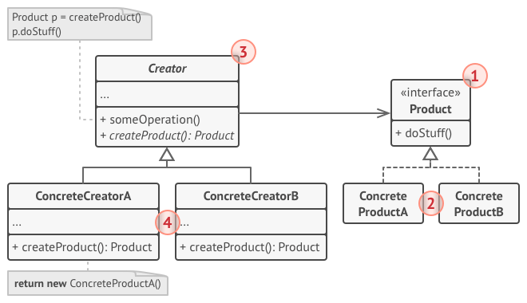

# DESIGN PATTERN

## Singleton

Singleton thuộc nhóm Creational Design Pattern

Singleton là một degign pattern mà:

1. Đảm bảo rắng một class chỉ có duy nhất một instance.
2. Cung cấp một cách global để truy cập tới instance đó.

<div align="center">
    
</div>

### Tại sao cần sử dụng Singleton

Ví dụ trong code, ta phải tạo ra hàng trăm đối tượng Database ở nhiều chỗ khác nhau trong code, những đối tượng này có cùng một nội dung, và vấn đề là nó rất lớn. Singleton sẽ giúp ta tạo ra tạo ra một đối tượng duy nhất và có thể truy cập bất cứ đâu trong code.

### Code Singleton

```java
public final class Singleton {
    private static Singleton INSTANCE = null;

    private Singleton();

    public static Singleton getInstance() {
        if(INSTANCE == null) {
            INSTANCE = new Singleton();
        }
        return INSTANCE;
    }
}
```

Dùng `Singleton` trong multithreading, thì không thể sử dụng phần code ở phía trên. `Singleton` Threadsafe sẽ như sau:

```java
public static final Singleton {
    private static Singleton INSTANCE = null;

    private Singleton();

    public static Singleton getInstance() {
        if(INSTANCE == null) {
            synchronized(Singleton.class) {
                if(INSTANCE == null) {
                    INSTANCE = new Singleton();
                }
            }
        }
        return INSTANCE;
    }
}
```

## Builder

<div align="center">
    
</div>

Khi hàm khởi tạo của một đối tượng phức tạp. Các thuộc tính cần phải sử dụng các thuật toán để khởi tạo, ta cần tách khởi tạo của từng thuộc tính cho đối tượng để dễ quản lý và code sạch hơn.

Mặc định, Builder pattern gồm có 4 thành phần cơ bản:

- `Product` là đối tượng cần tạo (đối tượng này phức tạp và có nhiều thuộc tính).
- `Builder` là abstract class hoặc interface khai báo phương thức tạo đối tượng.
- `ConcreteBuilder` thừa kế builder và cài đặt chi tiết cách tạo ra đối tượng.
- `Director` là nơi sẽ gọi tới Builder để tạo ra đối tượng.

Thông thường, những trường hợp đơn giản nguwoif ta sẽ gộp luôn Builder và ContreteBuidler thành `static nested class` bên trong `Product`

### Code Builder

```java

public class Car {

    private Wheel wheel;
    private Color color;

    private Car(CarBuilder builder) {
        this.wheel = builder.wheel;
        this.color = builder.color;
    }

    public Wheel getWheel() {
        return this.wheel;
    }

    public Color getColor() {
        return this.color;
    }

    private Car() {}

    public static class CarBuilder {
        private Wheel wheel;
        private Color color;

        public CarBuilder(Wheel wheel, Color color) {
            this.wheel = wheel;
            this.color = color;
        }

        public CarBuilder setWheel(Wheel wheel) {
            this.wheel = wheel;
            return this;
        }

        public CarBuilder setColor(Color color) {
            this.color = color;
            return this;
        }

        public Car build() {
            return new Computer(this);
        }
    }

}

```

## Factory Method

<div align="center">
    
</div>

`Factory Method` pattern là một creational pattern mà sử dụng các factory method để giải quyết vấn đề tạo đối tượng mà không phỉa chỉ định class chính xác của đối tượng sẽ được tạo. Điều này được thực hiện bằng các tạo các đối tượng bằng cách gọi một factory method. Hoặc được chỉ địh một interface và implemented bởi class con, hoặc implemented trong một class cha và được ghi đè tùy ý bởi các lớp dẫn xuất thay vì gọi một constructor.

Dùng `Factory Method` pattern khi:

- Một class không thể lường trước lớp đối tượng mà nó phải tạo
- Một class muốn các lớp con của nó chỉ định các đối tượng mà nó tạo ra

## Strategy

<div align="center">
    
</div>

`Strategy` pattern là một behavioral pattern. `Strategy` pattern được sử dụng khi ta có nhiều thuật toán cho một task nhất định và client quyết định thực hiện sẽ được sử dụng trong runtime.

Dùng `Strategy` pattern khi:

- Nhiều class liên quan chỉ khác nhau trong behavior của nó. Strategies cung cấp một để cấu hình một class hoặc một trong nhiều behavior.
- Bạn cần nhiều biến thể khác nhau của một thuật toán.
- Một class định nghĩa nhiều behavior và chúng xuất hiện dưới dạng câu điều kiện trong các operation của nó. Thay vì sử dụng nhiều câu điều kiện, chuyển các nhánh có điều kiện liên quan vào một Strategy class của riêng nó.

## Reference

- [Factory Method](https://en.wikipedia.org/wiki/Factory_method_pattern)
- [Stragety](https://www.journaldev.com/1754/strategy-design-pattern-in-java-example-tutorial)

