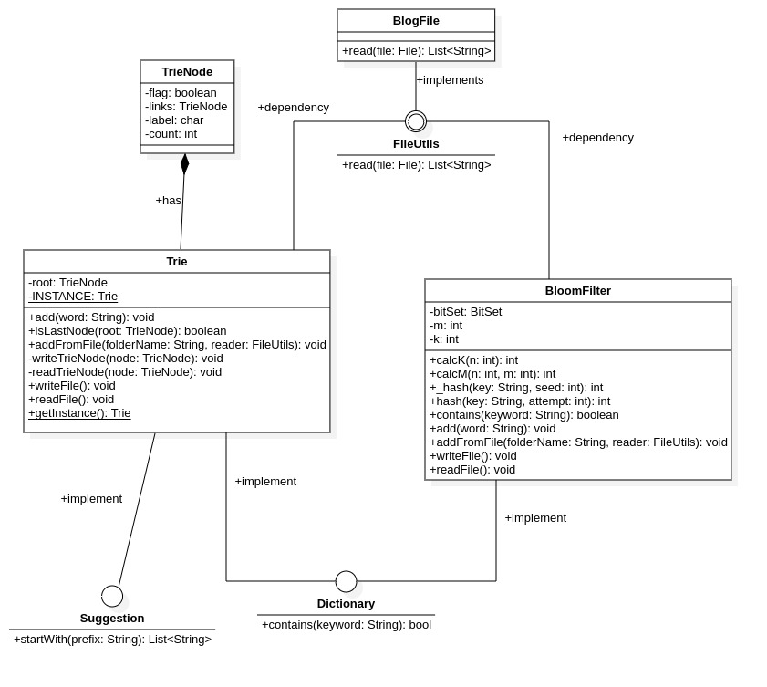
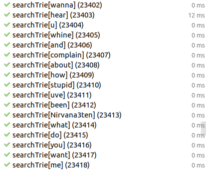
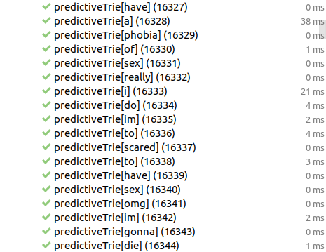

# Predictive Text

## Class Diagram

    

## Ứng dụng Design Pattern

### Dependency Inject

Ứng dụng cho inteface `FileUtils` giảm sự phụ thuộc của hàm `addFromFile`, khi cần thay đổi hàm `reader` không đọc dữ liệu từ file Blog. Ta có thể implement một class khác để đọc dữ liệu tương ứng.

## Kết quả Benchmark

### Search với Bloom Filter

    

### Search với Trie

    

### Prefix với Trie

    

