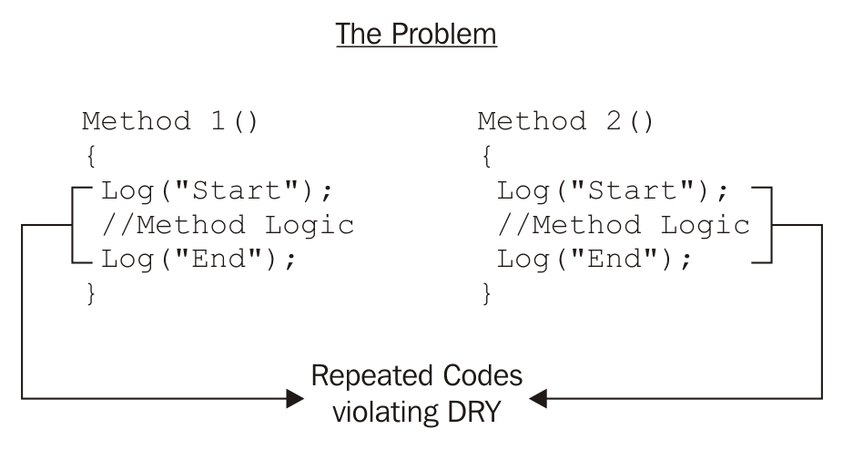
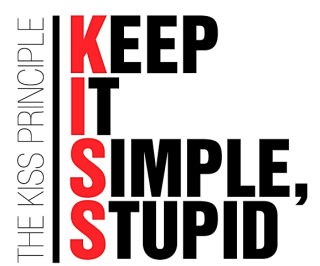
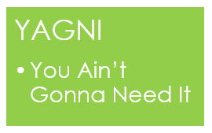

# NGUYÊN TẮC LẬP TRÌNH

## SOLID

<div align="center">
    
</div>

**SOLID** là viết tắt của 5 chữ cái đầu trong nguyên tấc thiết kế hướng đối tượng. Được đưa ra bởi Bob Martin và Michael Feathers. 5 nguyên tắc đó bao gồm:

- **S**ingle responsibility principle
- **O**pen/Closed principle
- **L**iskov substitution principle
- **I**nterface segregation principle
- **D**pendency inversion principle

### Single responsibility principle

Nguyên lý đầu tiên, có nghĩa là một class chỉ nên giữ một trách nhiệm duy nhất. Một class có quá nhiều chức năng sẽ trở nên cồng kềnh và trở nên khó đọc, khó maintain. Trong thực tế, việc thay đổi requirement là diễn ra rất thường xuyên, nên việc code trong sáng dễ, dễ đọc và dễ hiểu rất cần thiết;.

### Open/Closed principle

Nguyên lý này có ý nghĩa là nội dung có thể thoải mái mở rộng 1 class nhưng không được sửa dổi bên trong class đó.

### Liskov substitution principle

Nội dung của nguyên lý này là: bất cứ instance nào của class cha cũng có thể được thay thế bởi instance của class con của nó mà không làm thay đổi tính đúng đắn của chương trình.

Ví dụ: Khi có class cha là Vịt, thì class con của nó có thể là vịt xiêm, vịt trời,... tất cả các class con đều có khả năng của class cha là `Kêu`, `Bay`, nhưng `Vịt nhựa` thì không thể là class con của `Vịt` vì `Vịt nhựa` không thể bay.

### Interface segregation principle

Nội dung nguyên tắc này là: thay vì dùng 1 interface lớn, ta nên tách thành nhiều interface nhỏ, với nhiều mục đích cụ thể, client không nên phụ thuộc vào interface mà nó không sử dụng. Nguyên tắc này có thể hiểu rằng thay vì gộp tất cả vào 1 interface lớn, ta có thể chia nhỏ thành nhiều interface nhỏ hơn gồm các method liên quan tới nhau, như vậy sẽ dễ quản lý hơn.

### Dependency inversion principle

Nội dung nguyên tắc này là:

1. Các module cấp cao không nên phụ thuộc vào các modules cấp thấp. Cả 2 nên phụ thuộc vào abstraction.
2. Abstraction không nên phụ thuộc vào chi tiết, mà ngược lại.

## DRY

<div align="center">
    
</div>

**D**on't **R**epeat **Y**ourself (Đừng bao giờ lặp lại code) hay DRY là một nguyên lý cơ bản nhất trong lập trình được đưa ra nhằm mục đích hạn chế tối thiểu việc viết các đoạn code lặp đi lặp lịa nhiều lần chỉ để thực hiện các công việc giống nhau trong app.

Nguyên tắc DRY chỉ ra rằng nếu chung ta đagn muốn viết nhiều đoạn code giống nhau ở nhiều chỗ khác nhau, thì vì copy/paste đoạn code đó, chúng ta hãy đưa đoạn code đó vào một medthod riêng sau đó gọi method này từ những chỗ chúng ta cần gọi. Áp dụng nguyên tác này, code của chúng ta sẽ rõ ràng hơn và dễ bảo trì hơn.

### KISS

<div align="center">
    
</div>

KISS là **K**eep **I**t **S**imple, **S**tudpid. Có thể hiểu KISS có nghĩa là giữ cho code thật đơn giản, càng đơn giản, càng tốt. Viết code cho người khác vừa đọc đã hiểu bạn đang viết các gì, code của bạn thực hiện cái gì.

Việc áp dụng KISS cũng có thể hiểu như áp dụng nguyên lý Single Responsibility Principle. Chính việc tách code ra có thể làm cho ứng dụng của chúng ta trở nên đơn giản dễ đọc, dễ maintain. Mỗi đốí tượng chỉ đảm nhiệm một vai trò và có nghĩa rằng mọi dịch vụ mà đối tướng đó đáp wusng thì cũng chỉ được gói gọn vai trò đó.

```java

//method 1
public static boolean isEven(int number) {
    return (number & 1) == 0;
}

//method 2

public static boolean isEven(int number) {
    return (number % 2) == 0;
}
```

Có thể thấy rằng method 1 nhanh hơn method 2 do nó thực hiện trực tiếp trên bit. Nhưng method 2, người đọc có thể hiểu ngay đoạn code này đang làm gì, mà không cần phải nhớ đến việc một số `&` với 1 sẽ ra kết quả gì.

### Áp dụng KISS vào code

- Đặt tên hàm, biến, method, class, package, comment rõ nghĩa
- Không lạm dụng framework, pattern
- Chia task lớn thành các task nhỏ hơn để code rõ ràng hơn
- Giới hạn mỗi method chỉ 30-50 dòng, mỗi method chỉ nên thực hiện 1 chức năng.
- Hiểu rõ các vấn đề trước khi code
- Không sử dụng nhiều câu lệnh if trong 1 method, hãy tách nó ra thành các method khác nhau.

## YAGNI

<div align="center">
    
</div>

YAGNI là **Y**ou **A**ren't **G**onna **N**eed **I**t. Nguyên tắc này nghĩa là bạn không code quá phức tạp nếu không cần thiết. Không nhất thiết lúc nào cũng dùng những desgin pattern. Bạn không cần code những chức năng mà dựa đó là nó có thể xảy ra, nó có thể xảy ra mà hiện tại không dùng nó và nó có thể không bao giờ xảy ra. Bạn chỉ cần làm những việc cần thiết nhất cho ứng dụng chứ không cần phải phức tạp cho nó. Dẫn đến nhưng vấn đề cho maintain code.

## Tham khảo

- [SOLID](https://viblo.asia/p/solid-la-gi-ap-dung-cac-nguyen-ly-solid-trong-thiet-ke-maGK7WELKj2)
- [DRY](https://stackjava.com/principle/yangi-dry-la-gi-yangi-dry-trong-java.html)
- [KISS (1)](https://stackjava.com/principle/kiss-principle-nguyen-tac-kiss-trong-java.html)
- [KISS (2)](https://viblo.asia/p/nguyen-ly-kiss-trong-lap-trinh-gAm5yRzkKdb)
- [YAGNI](https://nghialom.wordpress.com/2017/12/21/kiss-yagni-va-dry/)