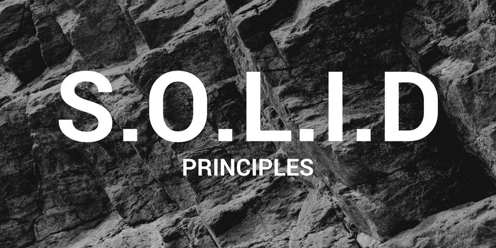

# NGUYÊN TẮC LẬP TRÌNH 

## SOLID

    

SOLID là viết tắt của 5 chữ cái đầu trong nguyên tấc thiết kế hướng đối tượng. Được đưa ra bởi Bob Martin và Michael Feathers. 5 nguyên tắc đó bao gồm:

- **S**ingle responsibility principle
- **O**pen/Closed principle
- **L**iskov substitution principle
- **I**nterface segregation principle
- **D**pendency inversion principle

### Single responsibility principle

Nguyên lý đầu tiên, có nghĩa là một class chỉ nên giữ một trách nhiệm duy nhất. Một class có quá nhiều chức năng sẽ trở nên cồng kềnh và trở nên khó đọc, khó maintain. Trong thực tế, việc thay đổi requirement là diễn ra rất thường xuyên, nên việc code trong sáng dễ, dễ đọc và dễ hiểu rất cần thiết;.

### Open/Closed principle

Nguyên lý này có ý nghĩa là nội dung có thể thoải mái mở rộng 1 class nhưng không được sửa dổi bên trong class đó.

### Liskov substitution principle

Nội dung của nguyên lý này là: bất cứ instance nào của class cha cũng có thể được thay thế bởi instance của class con của nó mà không làm thay đổi tính đúng đắn của chương trình.

Ví dụ: Khi có class cha là Vịt, thì class con của nó có thể là vịt xiêm, vịt trời,... tất cả các class con đều có khả năng của class cha là `Kêu`, `Bay`, nhưng `Vịt nhựa` thì không thể là class con của `Vịt` vì `Vịt nhựa` không thể bay.

### Interface segregation principle

Nội dung nguyên tắc này là: thay vì dùng 1 interface lớn, ta nên tách thành nhiều interface nhỏ, với nhiều mục đích cụ thể, client không nên phụ thuộc vào interface mà nó không sử dụng. Nguyên tắc này có thể hiểu rằng thay vì gộp tất cả vào 1 interface lớn, ta có thể chia nhỏ thành nhiều interface nhỏ hơn gồm các method liên quan tới nhau, như vậy sẽ dễ quản lý hơn.

### Dependency inversion principle

Nội dung nguyên tắc này là:

1. Các module cấp cao không nên phụ thuộc vào các modules cấp thấp. Cả 2 nên phụ thuộc vào abstraction.
2. Abstraction không nên phụ thuộc vào chi tiết, mà ngược lại.

## Tham khảo

[SOLID (1)](https://viblo.asia/p/solid-la-gi-ap-dung-cac-nguyen-ly-solid-trong-thiet-ke-maGK7WELKj2)
[SOLID (2)]